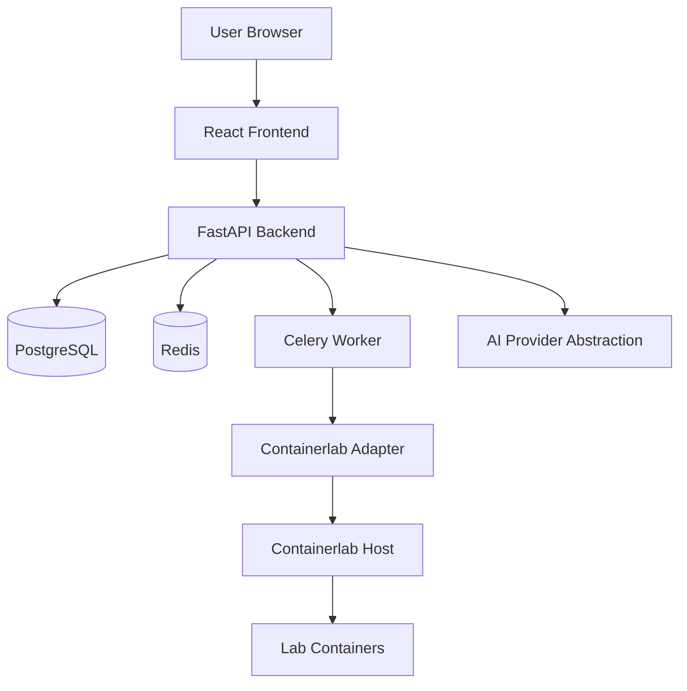

# AI-Powered ISP Academy MVP Architecture

## Purpose

AI-Powered ISP Academy MVP is a small, Containerlab-native training platform for hands-on ISP and network engineering labs. The MVP is intentionally scoped for one organization, one server, and a small internal pilot before any enterprise expansion.

The platform supports this core flow:

```text
Instructor creates lab template
Instructor creates ticket
Student starts ticket lab
Student troubleshoots inside lab
Student runs verification
System returns pass/fail result
Instructor monitors progress
```

## Architecture Goals

- Keep the first version small and useful.
- Use Containerlab as the only lab engine.
- Keep all network devices inside lab-owned containers.
- Separate HTTP request handling from long-running lab operations.
- Make security boundaries explicit from the first phase.
- Keep future expansion possible without adding enterprise complexity now.

## MVP System Context



## Runtime Components

| Component | Responsibility |
| --- | --- |
| React Frontend | User interface for login, labs, tickets, verification, and instructor/admin views. |
| FastAPI Backend | API layer, authentication, authorization, service orchestration, and data validation. |
| PostgreSQL | Persistent database for users, templates, labs, tickets, verification, AI previews, audit logs. |
| Redis | Celery broker/cache for background work and short-lived coordination. |
| Celery Worker | Executes long-running tasks such as lab start/stop/destroy and verification runs. |
| Containerlab Adapter | Safe wrapper around Containerlab command execution, used only by the worker. |
| Containerlab Host | Single Ubuntu server where Containerlab and Docker run lab containers. |
| AI Provider Abstraction | OpenAI-compatible interface for AI Lab Builder and AI Mentor Lite, disabled/configurable by environment. |

## Critical Command Boundary

FastAPI routes must never call Containerlab directly.

The API container must never have direct Containerlab binary access, Docker socket access, or host-level lab execution privileges.

In the MVP Docker Compose deployment, the API container must also avoid privileged mode, host networking, and host PID mode. Those host-level privileges are reserved for the Celery worker only.

Only the Celery worker may execute Containerlab operations, and it must do so through the Containerlab Adapter.

The current worker privilege setup is MVP-only technical debt. It is acceptable for the single-server pilot because Containerlab requires Docker and host network visibility, but it must be revisited before broader deployment.

Correct flow:

```text
API route
-> service layer
-> Celery task
-> Containerlab adapter
-> subprocess argument list
-> Containerlab host command
```

Wrong flows:

```text
API route
-> direct shell command
```

```text
API container
-> Docker socket
-> Containerlab or Docker operation
```

```text
API route
-> subprocess
-> containerlab deploy
```

## Worker Host Access Boundary

The Celery worker is the only application component allowed to interact with Containerlab.

Worker host access must be controlled and limited:

- Grant only the minimum host access required to run Containerlab for lab instances.
- Do not expose host execution access to the API container.
- Do not expose Docker socket access to the API container.
- Keep all lab file operations inside configured `LAB_ROOT`.
- Validate lab instance ownership before queueing worker tasks.
- Re-load and re-check lab state inside worker tasks before execution.
- Use subprocess argument lists, never `shell=True`.
- Log all Containerlab operations as `LabEvent` records once Phase 4 exists.

The MVP remains a single-server Docker Compose design. The worker may need special deployment treatment compared with the API container, but that privilege must stay isolated to the worker.

## Backend Layering

The backend should use Clean Architecture where practical:

```text
api routers
-> dependencies and permission checks
-> services
-> repositories
-> database models
```

Background tasks use the same service/repository boundaries where possible:

```text
celery task
-> service
-> adapter
-> repository
```

## Phase Boundary

Phase 1 is foundation only. It should create the FastAPI app, config, logging, database connection, Redis connection, Celery app, health/readiness/system endpoints, Dockerfile, Docker Compose, Alembic setup, and pytest setup.

Phase 1 should not create:

- User/auth business logic.
- Lab template logic.
- Containerlab adapter.
- Lab instance logic.
- Ticket logic.
- Verification logic.
- AI Lab Builder logic.
- AI Mentor logic.
- Instructor/Admin dashboards.

## Key Design Decisions

| Decision | Reason |
| --- | --- |
| Single-server Docker Compose deployment | Fits MVP scale and avoids premature distributed complexity. |
| API container has no Docker socket or Containerlab access | Prevents web/API compromise from becoming direct host lab control. |
| Celery for lab operations | Containerlab actions can be slow and should not block API requests. |
| Worker-only Containerlab execution | Keeps privileged lab operations isolated from request handling. |
| Repository and service layers | Keeps authorization, business logic, and persistence boundaries maintainable. |
| Lab-specific directories under `LAB_ROOT` | Prevents path traversal and makes cleanup safer. |
| AI preview before approval | AI output is untrusted and must be validated before creating templates or labs. |
| No production network integration | This is a lab-only training platform, not a network automation tool. |

## Deployment Shape

MVP deployment runs on one Ubuntu server:

```text
Docker Compose:
- backend API container
- frontend container
- PostgreSQL container
- Redis container
- Celery worker container

Host:
- Docker Engine
- Containerlab
- LAB_ROOT directory
```

Access boundary:

```text
API container:
- Can talk to PostgreSQL and Redis.
- Can enqueue Celery tasks.
- Cannot access Docker socket.
- Cannot execute Containerlab.
- Cannot write arbitrary host lab files.

Celery worker:
- Can talk to PostgreSQL and Redis.
- Can execute approved Containerlab operations through adapter.
- Can access only the configured lab runtime paths required for Containerlab.
- Must validate all paths under LAB_ROOT before file operations.
```

## Future Expansion Boundaries

The MVP should avoid implementing enterprise features now, but the architecture should avoid blocking them later.

Possible future additions:

- Organizations and multi-tenancy.
- Multi-host lab workers.
- Advanced verification parsers.
- React Flow topology editor.
- Certification engine.
- Observability stack.
- CI/CD and production hardening.

These are not Phase 0 or Phase 1 implementation targets.
