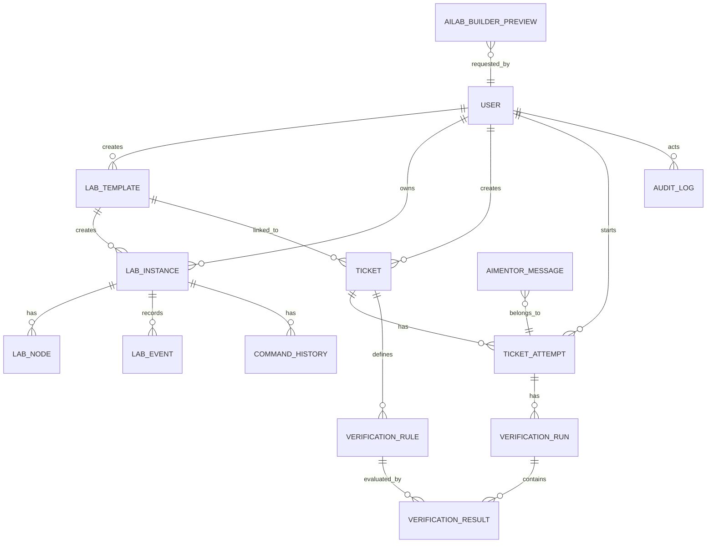

# Database Model

## Purpose

This document describes the MVP data model by implementation phase. Phase 1 has database connectivity and migration infrastructure only. It does not create business tables.

## Phase-by-Phase Entity Plan

| Phase | Entities |
| --- | --- |
| Phase 1 | No business entities. Database connection, SQLAlchemy base, and Alembic only. |
| Phase 2 | `User` |
| Phase 3 | `LabTemplate` |
| Phase 4 | `LabInstance`, `LabNode`, `LabEvent` |
| Phase 5 | `Ticket`, `TicketAttempt` |
| Phase 6 | `VerificationRule`, `VerificationRun`, `VerificationResult` |
| Later | `CommandHistory`, `AILabBuilderPreview`, `AIMentorMessage`, `AuditLog` |

## Mermaid ERD

The full MVP relationship map is shown for planning. Tables should still be implemented only in their assigned phase.

## Phase 1: Foundation Only

Phase 1 creates:

- SQLAlchemy base configuration.
- Async database session configuration.
- Alembic migration environment.
- Health/readiness checks for database connectivity.

Phase 1 must not create:

- User table.
- Lab template table.
- Lab instance tables.
- Ticket tables.
- Verification tables.
- AI, mentor, command history, or audit tables.

## Phase 2: User

Represents admins, instructors, and students.

Fields:

- `id`
- `email`
- `username`
- `hashed_password`
- `full_name`
- `role`
- `is_active`
- `created_at`
- `updated_at`

Role values:

- `ADMIN`
- `INSTRUCTOR`
- `STUDENT`

## Phase 3: LabTemplate

Reusable Containerlab lab definition created by Admin or Instructor.

Fields:

- `id`
- `name`
- `slug`
- `description`
- `category`
- `difficulty`
- `containerlab_yaml`
- `default_startup_config`
- `estimated_cpu`
- `estimated_memory_mb`
- `estimated_duration_minutes`
- `is_active`
- `created_by`
- `created_at`
- `updated_at`

## Phase 4: LabInstance, LabNode, LabEvent

### LabInstance

Student-owned runtime lab created from a LabTemplate.

Fields:

- `id`
- `template_id`
- `owner_id`
- `status`
- `lab_name`
- `lab_directory`
- `started_at`
- `stopped_at`
- `destroyed_at`
- `last_error`
- `created_at`
- `updated_at`

Status values:

- `CREATED`
- `STARTING`
- `RUNNING`
- `STOPPING`
- `STOPPED`
- `DESTROYING`
- `DESTROYED`
- `FAILED`

### LabNode

Node discovered or defined inside a lab instance.

Fields:

- `id`
- `lab_instance_id`
- `name`
- `kind`
- `role`
- `container_name`
- `management_ipv4`
- `status`
- `created_at`
- `updated_at`

### LabEvent

Append-only event log for lab lifecycle and task output.

Fields:

- `id`
- `lab_instance_id`
- `event_type`
- `message`
- `stdout`
- `stderr`
- `created_by`
- `created_at`

## Phase 5: Ticket, TicketAttempt

### Ticket

Instructor-created learning task linked to a lab template.

Fields:

- `id`
- `lab_template_id`
- `title`
- `slug`
- `description`
- `student_instructions`
- `hints`
- `hidden_solution`
- `status`
- `created_by`
- `published_at`
- `created_at`
- `updated_at`

Status values:

- `DRAFT`
- `PUBLISHED`
- `ARCHIVED`

### TicketAttempt

Student attempt for a ticket. Usually links to one lab instance.

Fields:

- `id`
- `ticket_id`
- `student_id`
- `lab_instance_id`
- `status`
- `started_at`
- `completed_at`
- `created_at`
- `updated_at`

## Phase 6: VerificationRule, VerificationRun, VerificationResult

### VerificationRule

Instructor-defined rule for validating a ticket.

Fields:

- `id`
- `ticket_id`
- `name`
- `target_node`
- `command`
- `parser_type`
- `assertion_type`
- `expected_value`
- `timeout_seconds`
- `is_active`
- `created_at`
- `updated_at`

### VerificationRun

One verification execution for a student attempt.

Fields:

- `id`
- `ticket_attempt_id`
- `status`
- `started_at`
- `finished_at`
- `created_at`

### VerificationResult

One rule result inside a verification run.

Fields:

- `id`
- `verification_run_id`
- `verification_rule_id`
- `status`
- `actual_output`
- `message`
- `created_at`

## Later Entities

### CommandHistory

Audited command execution history for lab-only commands.

Planned fields:

- `id`
- `lab_instance_id`
- `user_id`
- `target_node`
- `command`
- `exit_code`
- `stdout`
- `stderr`
- `created_at`

### AILabBuilderPreview

Stores generated AI lab preview before approval.

Planned fields:

- `id`
- `requested_by`
- `prompt`
- `lab_plan_json`
- `generated_containerlab_yaml`
- `generated_configs`
- `generated_verification_rules`
- `validation_status`
- `validation_errors`
- `approved_at`
- `approved_by`
- `created_lab_template_id`
- `created_at`
- `updated_at`

### AIMentorMessage

Stores student mentor conversations for an attempt.

Planned fields:

- `id`
- `ticket_attempt_id`
- `user_id`
- `role`
- `message`
- `metadata`
- `created_at`

### AuditLog

Security and operational audit trail.

Planned fields:

- `id`
- `actor_user_id`
- `action`
- `resource_type`
- `resource_id`
- `ip_address`
- `user_agent`
- `metadata`
- `created_at`

## Data Isolation Rules

- Student can only access own `LabInstance`.
- Student can only access own `TicketAttempt`.
- Student can only access own `CommandHistory`.
- Student can never access `Ticket.hidden_solution`.
- Instructor can access content and attempts related to their own learning content.
- Admin can access all data.

