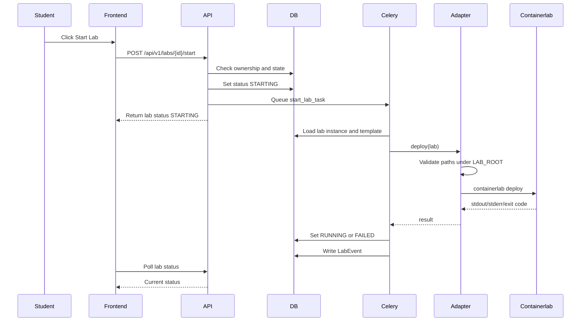
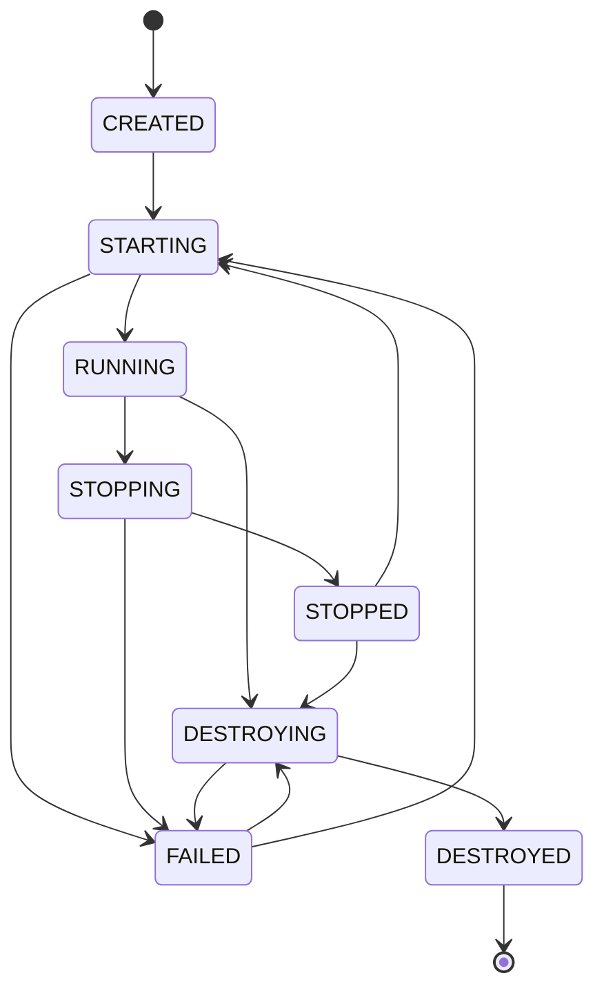

# Lab Lifecycle

## Lifecycle States

```text
CREATED
STARTING
RUNNING
STOPPING
STOPPED
DESTROYING
DESTROYED
FAILED
```

## State Meaning

| State | Meaning |
| --- | --- |
| `CREATED` | Lab instance exists in database and files may be prepared, but Containerlab is not running. |
| `STARTING` | Start task has been queued or is running. |
| `RUNNING` | Containerlab deployment succeeded and lab nodes are available. |
| `STOPPING` | Stop task has been queued or is running. |
| `STOPPED` | Lab containers are stopped but lab instance still exists. |
| `DESTROYING` | Destroy task has been queued or is running. |
| `DESTROYED` | Containerlab resources are removed. Lab record remains for audit/history. |
| `FAILED` | Last lifecycle operation failed. Error is stored in lab events and `last_error`. |

## Start Sequence



## Allowed State Transitions



## Lab Directory Lifecycle

```text
Create LabInstance
-> allocate LAB_ROOT/instances/<lab_instance_id>
-> write generated clab.yml and configs
-> deploy with Containerlab
-> store events and parsed node status
-> stop/destroy on request
-> cleanup directory after destroy according to retention policy
```

## Lab Start Rules

- Only active templates can be started.
- Student can start only own lab.
- Instructor/Admin can start labs only within permitted scope.
- Start operation is rejected if lab is already `STARTING`, `RUNNING`, `STOPPING`, or `DESTROYING`.
- Template validation must run before deployment.
- Runtime files must be copied/generated into the lab instance directory.

## Lab Stop Rules

- Stop operation is allowed only from `RUNNING`.
- Stop runs through Celery.
- Stop result creates a LabEvent.
- Failed stop sets `FAILED` and preserves logs.

## Lab Destroy Rules

- Destroy is allowed from `RUNNING`, `STOPPED`, `CREATED`, or `FAILED`.
- Destroy runs through Celery.
- Destroy removes Containerlab resources.
- Directory cleanup happens only inside `LAB_ROOT`.
- Database record remains for audit and student history.

## Failure Handling

On task failure:

- Set lab status to `FAILED`.
- Store `last_error`.
- Store stdout/stderr in `LabEvent`, with output length limits.
- Do not expose sensitive host paths or secrets to students.
- Allow Admin/Instructor to inspect full operational event details.

## Polling Strategy

MVP frontend can use simple polling:

```text
GET /api/v1/labs/{lab_id}/status every 2-5 seconds during transitions
```

WebSockets can be considered later, but are not required for MVP.

